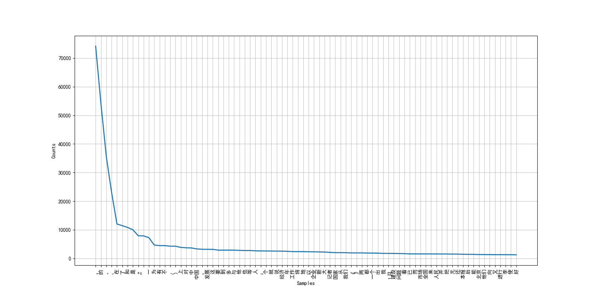

# HAN中文分词-2021 Spring NLP Homework

### 训练样本词频统计

使用`collection.Counter`和`nltk`相应工具包完成训练集词频统计分析。展示出现次数最多的前80个词。




完整的训练集词频统计信息见：[vocab-freq.txt](./results/vocab-freq.txt)。

### 结巴分词baseline

使用结巴分词默认配置（`jieba.cut`）得到结果于文件[jieba-test-result.txt](results/jieba-test-result.txt)中，执行测试脚本。

```bash
perl scripts/score datasets/training_vocab.txt datasets/test.txt results/jieba-test-result.txt
# 或者直接运行runeval.sh
```

示例代码：
```python
def write_test_result():
    with open(RESULT_FILE_TEST_IM, 'w+', encoding='utf-8') as f:
        f.writelines(['  '.join(jieba.cut(line)) + '\n' for line in test_raw])
```

得到结果：

```
RECALL: 0.787
PRECISION:      0.853
F1 :    0.818

OOV Rate:       0.058
OOV Recall:     0.583
IV Recall:      0.799
```


### 最大后向匹配

首先统计训练集词汇的长度分布，经观察得出，`max_length`选择4/5为最佳。


示例代码：
```python
def max_back(line: str, max_len = 4):
    res = []
    n = len(line)
    idx = 0
    while idx < n:
        lens = max_len
        while lens > 0:
            sub = line[idx: idx + lens]
            # print(sub)
            if sub in vocab:
                res.append(sub)
                idx += lens
                lens = max_len
            else:
                lens -= 1
                if lens == 0:
                    idx += 1
    return res
```

```txt
RECALL: 0.903
PRECISION:      0.890
F1 :    0.896

OOV Rate:       0.058
OOV Recall:     0.000
IV Recall:      0.958
```

更多实验结果和测试报告见[result](./results/)和[logs](./logs/)文件夹。

### Glove 预训练 + Bi-LSTM 模型

预训练Glove模型的embedding在文件夹[pretrain_models](https://github.com/RonDen/HanTokenization/tree/main/pretrained_models)中。
执行结果。

```txt
RECALL: 0.925
PRECISION:      0.926
F1 :    0.925

OOV Rate:       0.058
OOV Recall:     0.642
IV Recall:      0.942
```

可以改进的地方还有：

1. Glove用的出现词最小次数设为了3，可以调整
2. learning rate，dropout，hidden_size, hidden_layer可以调整
3. 暂时将标点符号映射成了一个词向量，可以考虑分开
4. 结合一些人工规则进一步处理分词结果
5. 结合不同分词模型进行集成


### 最大熵模型

```txt
result of maxent in iter 100
RECALL:	0.825
PRECISION:	0.838
F1 :	0.832

OOV Rate:	0.058
OOV Recall:	0.464
IV Recall:	0.847
```


### CRF++模型
template file
```txt
# Unigram
U02:%x[0,0]
U03:%x[1,0]
U06:%x[0,0]/%x[1,0]

# Bigram
B
```
仅仅使用了十分基础且简单的特征。

```txt
crf min_freq=3, cost=4
RECALL: 0.911
PRECISION:      0.927
F1 :    0.919

OOV Rate:       0.058
OOV Recall:     0.487
IV Recall:      0.937
```

