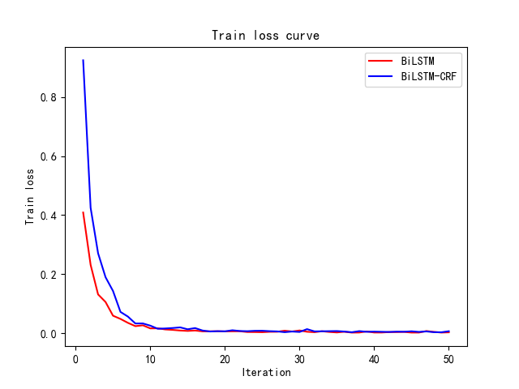

# HAN中文分词-2021 Spring NLP Homework

### 训练样本词频统计

使用`collection.Counter`和`nltk`相应工具包完成训练集词频统计分析。展示出现次数最多的前80个词。


完整的训练集词频统计信息见：[vocab-freq.txt](./results/vocab-freq.txt)。

### 结巴分词baseline

使用结巴分词默认配置（`jieba.cut`）得到结果于文件[jieba-test-result.txt](results/jieba-test-result.txt)中，执行测试脚本。

```bash
perl scripts/score datasets/training_vocab.txt datasets/test.txt results/jieba-test-result.txt
# 或者直接运行runeval.sh
```

示例代码：
```python
def write_test_result():
    with open(RESULT_FILE_TEST_IM, 'w+', encoding='utf-8') as f:
        f.writelines(['  '.join(jieba.cut(line)) + '\n' for line in test_raw])
```

得到结果：

```
RECALL: 0.787
PRECISION:      0.853
F1 :    0.818

OOV Rate:       0.058
OOV Recall:     0.583
IV Recall:      0.799
```


### 最大后向匹配

首先统计训练集词汇的长度分布，经观察得出，`max_length`选择4/5为最佳。


示例代码：
```python
def max_back(line: str, max_len = 4):
    res = []
    n = len(line)
    idx = 0
    while idx < n:
        lens = max_len
        while lens > 0:
            sub = line[idx: idx + lens]
            # print(sub)
            if sub in vocab:
                res.append(sub)
                idx += lens
                lens = max_len
            else:
                lens -= 1
                if lens == 0:
                    idx += 1
    return res
```

```txt
RECALL: 0.903
PRECISION:      0.890
F1 :    0.896

OOV Rate:       0.058
OOV Recall:     0.000
IV Recall:      0.958
```

更多实验结果和测试报告见[result](./results/)和[logs](./logs/)文件夹。

### 深度学习方法

代码主要位于`codes/`文件夹中，代码结构如下：

```
codes/:
	|--config.py:				各种模型默认设置的超参数
	|--dataset.py:				数据集的预处理和加载
	|--layers.py:				一些神经网络层
	|--models.py:				神经网络模型
	|--painting.py:				训练曲线图的绘制函数
	|--train.py:				模型训练主文件
	|--vocab.py:				字典的加载，转化等
```

实验报告中主要报告了五个不同组合的模型，下面说明各个模型的训练命令（注意：由于代码原因，需要先创建参数`last_model_path`,`best_model_path`,`result_path`所在文件夹，才能顺利运行代码）

- 模型1

  ```
  python3 train.py
  ```

- 模型2

  ```
  python3 train.py \
    	--last_model_path ../models/bilstmcrf/last/model.bin \
    	--best_model_path ../models/bilstmcrf/best/model.bin \
    	--result_path ../results/bilstmcrf/test_result.txt \
    	--model_type bilstmcrf
  ```

- 模型3

  ```
  python3 train.py \
    	--last_model_path ../models/bilstm_new_merge/last/model.bin \
    	--best_model_path ../models/bilstm_new_merge/best/model.bin \
    	--result_path ../results/bilstm_new_merge/test_result.txt \
    	--model_type bilstm --merge 1
  ```

- 模型4

  ```
   python3 train.py \
    	--last_model_path ../models/bilstm_new_merge_random/last/model.bin \
    	--best_model_path ../models/bilstm_new_merge_random/best/model.bin \
    	--result_path ../results/bilstm_new_merge_random/test_result.txt \
    	--model_type bilstm --merge 1
  ```

- 模型5

  ```
  python3 train.py \
    	--last_model_path ../models/transformer_new_merge_separate/last/model.bin \
    	--best_model_path ../models/transformer_new_merge_separate/best/model.bin \
    	--result_path ../results/transformer_new_merge_separate/test_result.txt \
    	--model_type transformer --merge 1 --separate 1 --report_steps 250
  ```

训练曲线如下：




更多实验结果和测试报告见[result](./results/)和[logs](./logs/)文件夹以及[EvalResult.md](./EvalResult.md)文件。

### 最大熵模型

```txt
result of maxent in iter 100
RECALL:	0.825
PRECISION:	0.838
F1 :	0.832

OOV Rate:	0.058
OOV Recall:	0.464
IV Recall:	0.847
```


### CRF++模型
template file
```txt
# Unigram
U02:%x[0,0]
U03:%x[1,0]
U06:%x[0,0]/%x[1,0]

# Bigram
B
```
仅仅使用了十分基础且简单的特征。

```txt
crf min_freq=3, cost=4
RECALL: 0.911
PRECISION:      0.927
F1 :    0.919

OOV Rate:       0.058
OOV Recall:     0.487
IV Recall:      0.937
```

